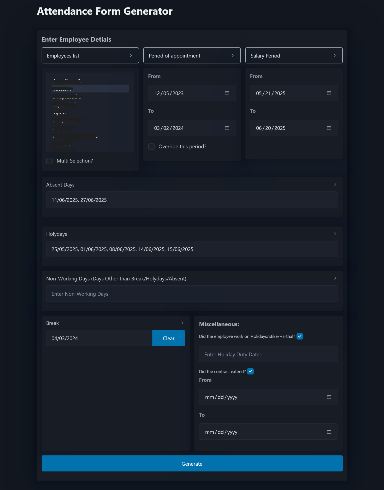
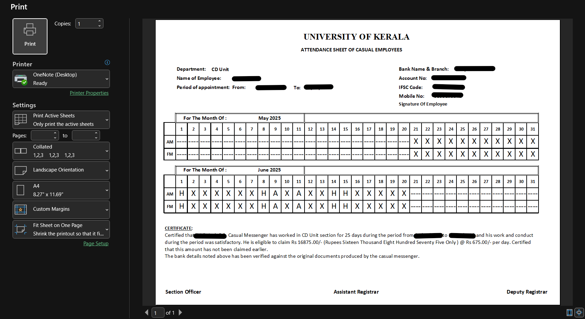

Attendance Form Generator
=========================

A comprehensive web application designed to automate the generation of attendance statements for contract employees, streamlining the process from manual form creation (taking up to 2 days per cycle) to automated generation in minutes.

🎯 Overview
-----------

This system was developed to replace tedious manual attendance tracking and form creation processes for the CD Unit department. The application generates professional Excel-based attendance forms with automated calculations, holiday tracking, and certificate generation for various employee types including messengers, laborers, drivers, and buggy operators.

📸 Application Screenshots
--------------------------

### Main Interface

### Generated Excel File

✨ Key Features
--------------

### 🔧 Core Functionality

*   **Employee Database Integration**: Centralized employee management with detailed records
*   **Multi-Employee Processing**: Batch generate forms for multiple employees simultaneously
*   **Intelligent Date Management**: Automatic salary period calculation with customizable ranges
*   **Smart Holiday Detection**: Automated weekend and holiday identification with manual override options
*   **Break Period Calculation**: Automatic next working day calculation after contract expiration

### 📅 Advanced Date Handling

*   **Salary Period Auto-calculation**: Automatically sets periods from 21st of previous month to 20th of current month
*   **Holiday Management**: Tracks Sundays and second Saturdays as holidays with custom additions
*   **Contract Period Tracking**: Monitors appointment periods with extension support
*   **Absence Tracking**: Multi-date absence selection with visual calendar interface
*   **Non-working Day Management**: Handles days outside contract periods or irrelevant to salary calculation

### 📄 Form Generation Features

*   **Dynamic Certificate Generation**: Role-specific certificates for different employee types
*   **Salary Calculations**: Automatic remuneration calculation based on present days and daily wages
*   **Multi-language Support**: Number-to-words conversion for monetary amounts
*   **Template-based Output**: Uses Excel macro-enabled templates for consistent formatting
*   **Bank Details Integration**: Automatic population of employee banking information

### 💼 Employee Management

*   **Role-based Processing**:
    *   Contract Messengers (EA I section)
    *   Daily Wage Employees (AD A VIII section)
    *   Buggy Operators (dedicated section)
    *   Laborers and Drivers
*   **Contract Extension Handling**: Support for contract period extensions with proper documentation
*   **Holiday Duty Tracking**: Special certificates for employees working on holidays/strikes

🛠️ Technical Architecture
--------------------------

### Backend Technologies

*   **Flask Framework**: Lightweight web framework for rapid development
*   **SQLite Database**: Embedded database for employee record management
*   **OpenPyXL**: Excel file manipulation and template processing
*   **Pandas**: Date range generation and data manipulation
*   **PyYAML**: Configuration management through YAML files

### Frontend Technologies

*   **Pico CSS Framework**: Modern, semantic CSS framework for clean UI
*   **Flatpickr**: Advanced date picker with multi-date selection
*   **jQuery**: DOM manipulation and AJAX requests
*   **Modal Dialogs**: User-friendly confirmation and input dialogs

### File Structure

    attendanceformgen_v2/
    ├── config/                 # Configuration files
    │   ├── excel_cell_config.yaml
    │   └── other_constants.yaml
    ├── src/
    │   ├── handlers/           # Excel workbook processing
    │   ├── utils/              # Utility modules
    │   ├── static/             # Frontend assets
    │   ├── web_template/       # HTML templates
    │   └── webserver.py        # Flask application
    ├── templates/              # Excel templates
    └── output/                 # Generated forms

🚀 Installation & Setup
-----------------------

### Prerequisites

*   Python 3.8+
*   SQLite3
*   Modern web browser

### Installation Steps

1.  **Clone the repository**
    
    bash
    
        git clone <repository-url>
        cd attendanceformgen_v2
    
2.  **Install dependencies**
    
    bash
    
        pip install flask openpyxl pandas pyyaml
    
3.  **Database Setup**
    *   Place your employee database file in `src/database/`
    *   Ensure the database follows the required schema
4.  **Configuration**
    *   Update `config/other_constants.yaml` with your organization details
    *   Modify `config/excel_cell_config.yaml` for custom Excel layouts
5.  **Run the application**
    
    bash
    
        cd src
        python webserver.py
    
6.  **Access the application**
    *   Open your browser and navigate to `http://localhost:5005`

📖 Usage Guide
--------------

### Basic Workflow

1.  **Select Employee(s)**: Choose single or multiple employees from the dropdown
2.  **Set Periods**: Configure appointment and salary periods (auto-populated)
3.  **Mark Attendance**:
    *   Select absent days using the date picker
    *   Mark holidays and non-working days
    *   Set break periods if applicable
4.  **Special Cases**:
    *   Check holiday duty if employee worked on holidays
    *   Mark contract extensions if applicable
5.  **Generate**: Click generate to create Excel forms

### Advanced Features

*   **Period Override**: Manually override default appointment periods
*   **Multi-selection Mode**: Generate forms for multiple employees with same parameters
*   **Automatic Calculations**:
    *   Present days = Total days - (Absent + Holidays + Breaks + Non-working)
    *   Salary = Present days × Daily wage rate
*   **Smart Defaults**: System automatically populates weekends and calculates next working day

⚙️ Configuration
----------------

### Employee Database Schema

sql

    CREATE TABLE employee_details (
        name TEXT PRIMARY KEY,
        gender TEXT,
        post TEXT,
        employee_id TEXT,
        bank_name TEXT,
        ifsc_code TEXT,
        account_number TEXT,
        mobile_number TEXT,
        period_from DATE,
        period_to DATE
    );

### Daily Wage Rates

*   Messenger: ₹675/day
*   Labourer: ₹675/day
*   Driver: ₹725/day
*   Buggy Operator: ₹730/day

🎨 User Interface Features
--------------------------

### Modern Design Elements

*   **Dark/Light Theme Support**: Responsive design with theme switching
*   **Interactive Components**:
    *   Multi-select dropdowns with search
    *   Calendar widgets with multi-date selection
    *   Collapsible help sections with detailed explanations
    *   Modal confirmations for critical actions

### User Experience Enhancements

*   **Contextual Help**: Expandable sections explaining each field's purpose
*   **Smart Defaults**: Automatic population of common values
*   **Visual Feedback**: Clear indication of selected dates and options
*   **Responsive Layout**: Works seamlessly across desktop and tablet devices

📊 Output Generation
--------------------

The system generates professional Excel forms (.xlsm) with:

*   **Employee Details**: Name, designation, bank details, contact information
*   **Attendance Grid**: Visual representation of present/absent/holiday days
*   **Certificates**: Auto-generated text based on employee type and work pattern
*   **Calculations**: Automatic salary computation with number-to-words conversion
*   **Professional Formatting**: Consistent layout matching organizational standards

🔍 Key Benefits
---------------

*   **Time Savings**: Reduces form generation from 2 days to minutes
*   **Accuracy**: Eliminates manual calculation errors
*   **Consistency**: Standardized format across all attendance forms
*   **Scalability**: Handles multiple employees and salary periods efficiently
*   **Audit Trail**: Maintains records of all generated forms
*   **Flexibility**: Accommodates various employment types and special cases

